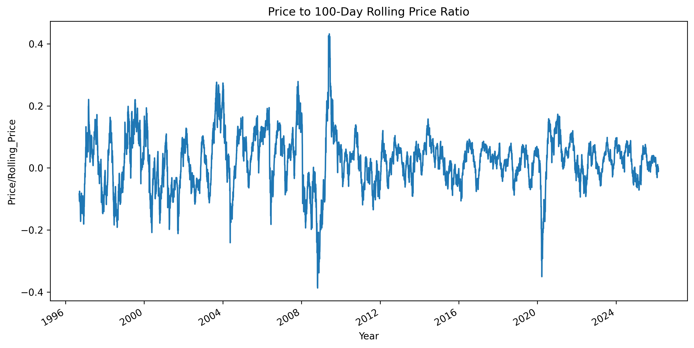

# NIFTY50 Stock Price Prediction

This project predicts the next day's NIFTY50 index price using various machine learning models. It includes data preprocessing, feature engineering, model training, evaluation, and a simple trading strategy backtest.

## Table of Contents
- [Features](#features)
- [Installation](#installation)
- [Usage](#usage)
- [Data](#data)
- [Models](#models)
- [Results](#results)
- [Contributing](#contributing)
- [License](#license)

## Features
- Data collection and preprocessing for NIFTY50 historical data
- Feature engineering including technical indicators (RSI, moving averages, volatility, etc.)
- Training and evaluation of multiple ML models
- Directional accuracy and strategy return metrics
- Jupyter notebooks for EDA and modeling

## Installation
1. Clone the repository:
   ```bash
   git clone https://github.com/Rajhans-123/stock-price.git
   cd stock-price
   ```

2. Create a virtual environment:
   ```bash
   python -m venv venv
   source venv/bin/activate  # On Windows: venv\Scripts\activate
   ```

3. Install dependencies:
   ```bash
   pip install -r requirements.txt
   ```

## Usage
1. **Data Collection**: Go to NSE HISTORICAL DATA website and download NIFTY50 Index Data.
2. **Exploratory Data Analysis**: Open `src/eda.ipynb` for data exploration.
3. **Model Training and Evaluation**: Run `src/model.ipynb` to train models and view results.
4. **Results**: Check `results/` for model performance metrics.

## Data
- **Source**: NIFTY50 historical data (CSV format) from NSE Historical Data
- **Features**: Date, Open, High, Low, Price, Volume, Change %, plus engineered features like Return, RSI, Volatility, etc.
- **Target**: Next day's percentage return

## Models
The following models are trained and evaluated:
- **Linear Regression (lr)**: Baseline linear model
- **Random Forest (rf)**: Ensemble tree-based model
- **XGBoost (xgb)**: Gradient boosting
- **LightGBM (lgbm)**: Efficient gradient boosting
- **SVR (svr)**: Support Vector Regression

Hyperparameter tuning is performed on the best-performing model using RandomizedSearchCV, optimizing for strategy equity.

### Metrics
- **MSE**: Mean Squared Error (lower better)
- **MAE**: Mean Absolute Error (lower better)
- **Directional Accuracy**: Percentage of correct direction predictions (higher better)
- **Final Equity**: Cumulative return from a simple long/short strategy based on predictions (higher better)

## Results
Based on the latest evaluation:

| Model       | MSE          | MAE          | Directional Accuracy | Final Equity |
|-------------|--------------|--------------|----------------------|--------------|
| rf          | 9.137e-05    | 0.00697      | 0.499                | 2.048        |
| xgb         | 8.669e-05    | 0.00674      | 0.531                | 3.439        |
| lgbm        | 8.903e-05    | 0.00681      | 0.529                | 2.819        |
| lr          | 8.714e-05    | 0.00671      | 0.560                | 2.846        |
| svr         | 1.135e-04    | 0.00795      | 0.547                | 2.349        |
| best_xgb    | 8.613e-05    | 0.00670      | 0.547                | 3.735        |

**Best Model**: Tuned XGBoost (highest final equity)

### Final Tuned XGBoost Metrics
- **MSE**: 8.613273634197784e-05
- **MAE**: 0.006704356643201695
- **Directional Accuracy**: 0.5472088215024121
- **Final Equity**: 3.735016922473307

### Tuned Models
Hyperparameter tuning was performed on XGBoost using RandomizedSearchCV with a custom scorer optimizing for Final Equity. The tuned model outperforms the default XGBoost in both directional accuracy and strategy performance.

### Plots
Below are two key EDA plots included in the repository:

- **100 Day Moving Average**

   

- **Price to Rolling Close Ratio**

   

### SHAP Summary
Below is an image which shows SHAP summay on models prediction

- **SHAP**

   

### Key Learning
Applying Log Transformation before and after Feature Engineering -

Before -> Final Equity = 3.439 After -> Final Equity = 3.735

In the previous dataset, I applied the log transformation after completing feature engineering, and this approach already improved the model performance. This likely worked because the model first learned meaningful predictive features from the engineered variables, and the subsequent log transformation helped stabilize variance and reduce the impact of extreme price values during training. However, in the current experiment, applying log transformation before hyperparameter tuning produced better results. This may be because transforming the target variable earlier allowed the model to optimize parameters based on a more normalized and less skewed data distribution, which is particularly beneficial for stock price data that often contains heavy tails and large fluctuations. As a result, tuning the model on log-transformed data improved pattern learning and reduced prediction error compared to performing the transformation later in the pipeline.

## Contributing
Contributions are welcome! Please fork the repository and submit a pull request.

## License
This project is licensed under the MIT License.

## Contact Information
email - rentalarrajhans@gmail.com</content>
