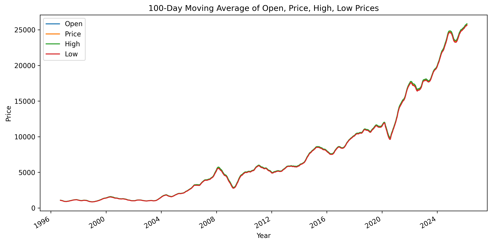
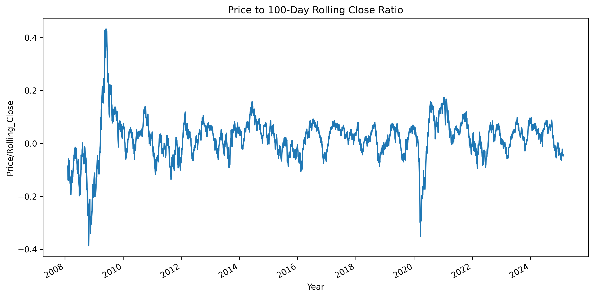

# NIFTY50 Stock Price Prediction

This project predicts the next day's NIFTY50 index price using various machine learning models. It includes data preprocessing, feature engineering, model training, evaluation, and a simple trading strategy backtest.

## Table of Contents
- [Features](#features)
- [Installation](#installation)
- [Usage](#usage)
- [Data](#data)
- [Models](#models)
- [Results](#results)
- [Contributing](#contributing)
- [License](#license)

## Features
- Data collection and preprocessing for NIFTY50 historical data
- Feature engineering including technical indicators (RSI, moving averages, volatility, etc.)
- Training and evaluation of multiple ML models
- Directional accuracy and strategy return metrics
- Jupyter notebooks for EDA and modeling

## Installation
1. Clone the repository:
   ```bash
   git clone https://github.com/Rajhans-123/stock-price.git
   cd stock-price
   ```

2. Create a virtual environment:
   ```bash
   python -m venv venv
   source venv/bin/activate  # On Windows: venv\Scripts\activate
   ```

3. Install dependencies:
   ```bash
   pip install -r requirements.txt
   ```

## Usage
1. **Data Collection**: Run `src/getting_data.py` to fetch or prepare the data.
2. **Exploratory Data Analysis**: Open `src/eda.ipynb` for data exploration.
3. **Model Training and Evaluation**: Run `src/model.ipynb` to train models and view results.
4. **Results**: Check `results/` for model performance metrics.

## Data
- **Source**: NIFTY50 historical data (CSV format)
- **Features**: Date, Open, High, Low, Close, Volume, plus engineered features like Return, RSI, Volatility, etc.
- **Target**: Next day's percentage return

## Models
The following models are trained and evaluated:
- **Linear Regression (lr)**: Baseline linear model
- **Random Forest (rf)**: Ensemble tree-based model
- **XGBoost (xgb)**: Gradient boosting
- **LightGBM (lgbm)**: Efficient gradient boosting
- **SVR (svr)**: Support Vector Regression

### Metrics
- **MSE**: Mean Squared Error (lower better)
- **MAE**: Mean Absolute Error (lower better)
- **Directional Accuracy**: Percentage of correct direction predictions (higher better)
- **Final Equity**: Cumulative return from a simple long/short strategy based on predictions (higher better)

## Results
Based on the latest evaluation:

| Model | MSE       | MAE       | Directional Accuracy | Final Equity |
|-------|-----------|-----------|----------------------|--------------|
| rf    | 0.00007803 | 0.00667636 | 0.4756              | 0.9434      |
| xgb   | 0.00006936 | 0.00632260 | 0.4588              | 0.9044      |
| lgbm  | 0.00006852 | 0.00625871 | 0.4773              | 1.0309      |
| lr    | 0.00006129 | 0.00560635 | 0.5378              | 0.9523      |
| svr   | 0.00052532 | 0.02175594 | 0.4471              | 0.7205      |

**Best Model**: LightGBM (highest final equity)

### Final LightGBM Metrics
- **MSE**: 5.8652379625116546e-05
- **MAE**: 0.005581717623957068
- **Directional Accuracy**: 0.5126050420168067
- **Final Equity**: 1.1252386647447876

### Plots
Below are two key EDA plots included in the repository:

- **100 Day Moving Average**

   

- **Price to Rolling Close Ratio**

   

## Contributing
Contributions are welcome! Please fork the repository and submit a pull request.

## License
This project is licensed under the MIT License.</content>